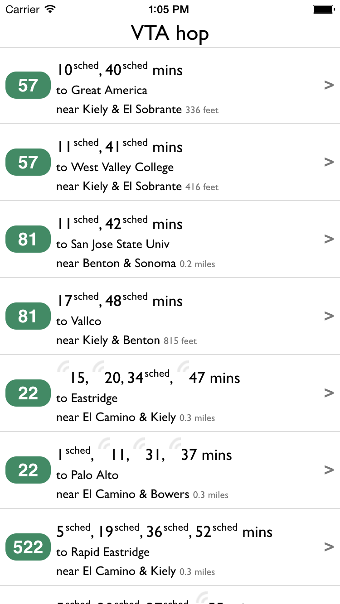
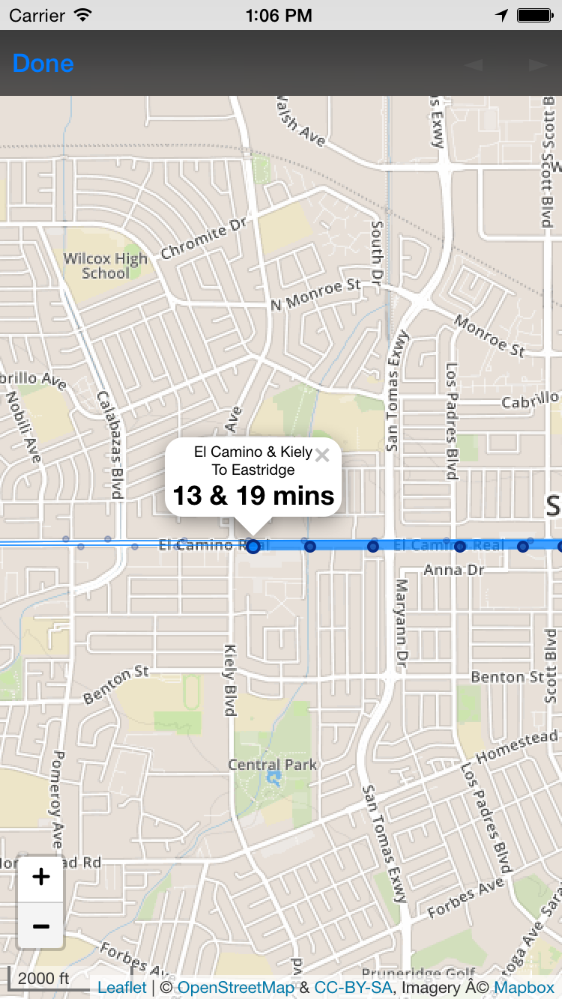

### About
**VTA hop** is an iPhone app that demos a crowdsourced transit information system.   

In our scenario VTA would add iBeacons to their buses and riders would download this app to their phone.  When a rider gets on a bus, their phone senses the iBeacon and starts sending the bus's GPS location.  Then the prediction system (http://transitime.org) can add real time predictions for that bus.  The novel utility of iBeacons is that GPS sending can be turned on automatically as the rider steps on an iBeacon equipped bus, they don't even need to open the app.

For riders **VTA hop** is mostly about getting info on their bus's arrival time.  But it's got a great bonus, just by having it on their phone they can help improve VTA for everyone.

This is an entry in VTA's Hack My Ride 2.0 hackathon http://hackmyride2.devpost.com/.

Here's a snapshot, the location is centered on a rider's current position.  Scheduled buses are indicated with <sup>sched</sup> and live predictions with <sup> </sup>.



And a map is available when clicking on the right arrow:



### Tech
**VTA hop** is cordova app. It's tested on iOS, but Android should work great.  (Other platforms have less support for iBeacon plugins).  It uses the cordova plugins geolocation, inappbrowser, and com.unarin.cordova.beacon.

### Development

Some quick development notes.  

Once cordova and xcode are installed and working, add the plugins and add the ios platform:
```
cordova plugin add com.unarin.cordova.beacon
cordova plugin add cordova-plugin-geolocation
cordova plugin add cordova-plugin-inappbrowser
cordova platform add ios
```

You should get an api key from http://transitime.org

The gulp file will automatically build and compile the cordova platform files from source code whenever it they are saved.  Use ```gulp dev``` to run it in the background.  In config.xml you can change the ```<content src=/>``` element to point to a live webserver. ```cordova serve``` works well for that.  On iOS you can attach Safari dev tools to either the device or the simulator.  Then you can edit your javascript and html, save, hit reload in safari and see your changes right away without reinstalling the app.  You can use the webkit dev tools on javascript running in situ.  

There are demo bus predictions to use for development (predictionsByLocEx{2,3}.json).
